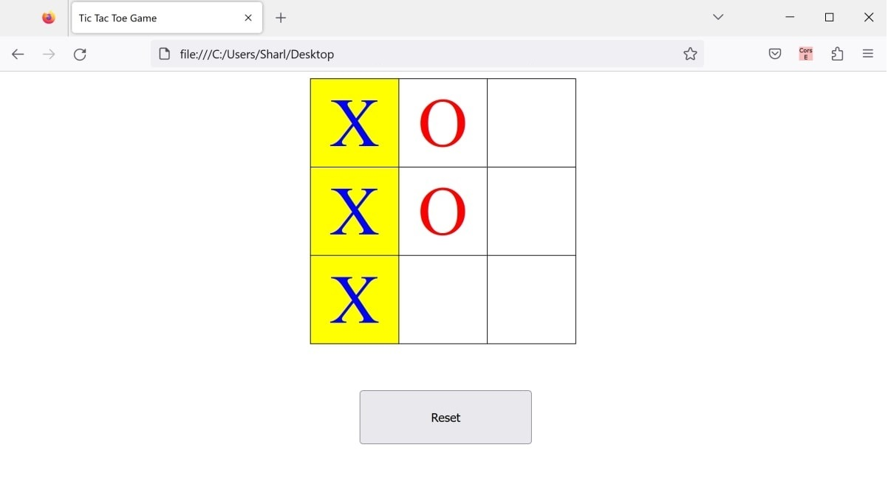

# JavaScript-Tic-Tac-Toe-Game
This is a Tic-Tac-Toe game created using HTML, CSS, and JavaScript.

The project consists of:
* index.html - Simple HTML page to open in a browser
* styles.css - Styling for the HTML page.
* script.js - Functionality for the Tic-Tac-Toe game.

## To Run

* Click on the index.html file to open it in a web browser. Play the game by clicking on the cells in the grid to add "X" or "O" symbols.

## Example

